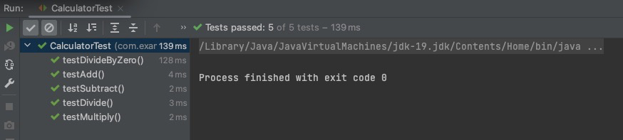
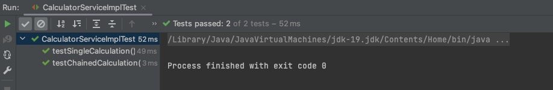
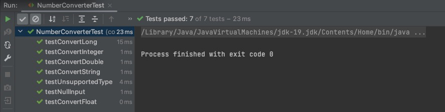

# Implement a Flexible Calculator


## Features

- Operations: Define an enum named Operation that includes basic operations
like ADD, SUBTRACT, MULTIPLY, and DIVIDE.
-  Basic Calculation Method: Implement a method calculate(Operation op, Number
   num1, Number num2) in the Calculator class that performs a single operation between
   two numbers and returns the result.
-  Chaining Operations: Implement a method that allows chaining multiple operations on a
   single value, similar to how basic calculators work. This should enable users to start with an
   initial value and perform a series of operations sequentially.
-  Extensibility: The Calculator class should allow new operations to be added without
   requiring changes to its existing code.
-  IoC Compatibility: Ensure the design is compatible with an Inversion of Control (IoC)
   environment, allowing for external management of dependencies to enable easy testing and
   swapping of implementations.
-  Error Handling: The solution should handle invalid operations gracefully (e.g., operations not
   supported by the calculator).
-  Testing: Write unit tests to verify your solution, including both normal cases and edge cases.

## Environment
- Java
- SpringBoot
- Junit

## Design Pattern

- Strategy

## Instructions

- Port: 8090

### Examples

#### Basic Operation
input:
```json
{
    "op": "ADD",
    "num1": "4",
    "num2": 2
}
```
output:

```json
{
   "code": "200",
   "message": "Success",
   "data": 6
}
```

input:
```json
{
   "op": "ADD",
   "num1": "acvdsa",  
   "num2": 2
}
```
output:

```json
{
   "code": "400 BAD_REQUEST",
   "message": "Character a is neither a decimal digit number, decimal point, nor \"e\" notation exponential mark.",
   "data": null
}
```
input:
```json
{
   "op": "ADD",
   "num1": null,
   "num2": 2
}
```
output:

```json
{
   "code": "400",
   "message": "Value cannot be null",
   "data": null
}
```

input:
```json
{
   "op": "MAD",
   "num1": 1,
   "num2": 2
}
```
output:

```json
{
   "code": "400",
   "message": "Unsupported operation value: MAD",
   "data": null
}
```

#### Chain Operation
input:
```json
{
   "initialValue": -1,
   "items": [
      {
         "op": "ADD",
         "num": 5.0
      },
      {
         "op": "SUBTRACT",
         "num": "2"
      },
      {
         "op": "MULTIPLY",
         "num": 3
      },
      {
         "op": "DIVIDE",
         "num": 1.5
      }
   ]
}
```
output:

```json
{
   "code": "200",
   "message": "Success",
   "data": 4.00
}
```

```json
{
   "initialValue": -1,
   "items": [
      {
         "op": "ADD",
         "num": "df5.0"
      },
      {
         "op": "SUBTRACT",
         "num": "2"
      },
      {
         "op": "MULTIPLY",
         "num": 3
      },
      {
         "op": "DIVIDE",
         "num": 1.5
      }
   ]
}
```
output:

```json
{
   "code": "400",
   "message": "Character d is neither a decimal digit number, decimal point, nor \"e\" notation exponential mark.",
   "data": null
}
```

```json
{
   "initialValue": -1,
   "items": [
      {
         "op": "AdDD",
         "num": "df5.0"
      },
      {
         "op": "SUBTRACT",
         "num": "2"
      },
      {
         "op": "MULTIPLY",
         "num": 3
      },
      {
         "op": "DIVIDE",
         "num": 1.5
      }
   ]
}
```
output:

```json
{
   "code": "400",
   "message": "Unsupported operation value: AdDD",
   "data": null
}
```


## Unit Test

#### CalculatorTest



#### CalculatorServiceImplTest


#### NumberConverterTest

